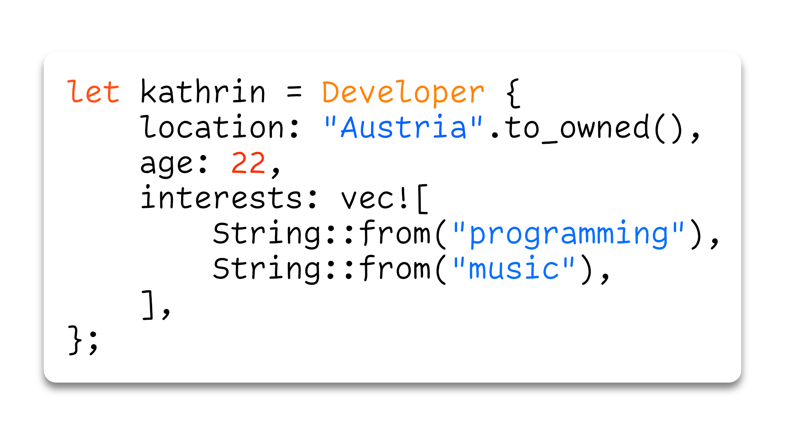

    
     
     
    🔭 I’m currently working at Kärntner Sparkasse AG. 
    📫 How to reach me: GitHub, Twitter or Avian Carrier Pidgeons 
    ⚡ Fun fact: I only function properly when provided with tea and headphones.

### Things I work with

    
    
    
    
    
    
    
    
    
    
    
    

### What I'm listening to

